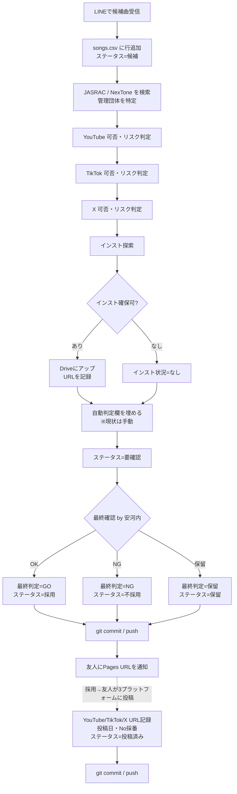

# 作業手順書（SOP）

候補曲を受け取ってから友人に判定結果を返すまでの標準作業手順。

---

## 1. 目的

友人（ご本人）から「次に歌いたい候補曲」を LINE で受け取り、**著作権をクリアし、インスト音源を確保し、GO / NG の判定を返す**こと。これが安河内の主担当業務。

歌・MIX・サムネ等の制作は友人が担当するため、**事務担当（安河内）が候補曲調査を巻き取ることで、友人が制作に集中できる**状態を作る。

---

## 2. 登場人物・ツール

| 役割 | 担当 |
|---|---|
| 制作（歌・MIX・サムネ） | 友人 |
| 候補曲提案 | 友人 |
| 著作権調査・インスト確保・判定記録 | 安河内 |
| 最終GO/NG判断 | 安河内（友人が異論あれば後で調整） |

| ツール | 用途 |
|---|---|
| LINE | 友人 → 安河内 への候補曲受け渡し |
| `songs.csv` | 全曲の状態管理（候補も投稿済みも一元） |
| Google Drive `hi-to0_inst/` | インスト音源の保管・友人への受け渡し |
| GitHub | リポジトリ管理・進捗共有 |
| GitHub Pages | 友人向け状況確認画面（`https://makotize-dev.github.io/youtube-support/`） |
| JASRAC J-WID | https://www2.jasrac.or.jp/eJwid/ |
| NexTone 作品検索 | https://search.nex-tone.co.jp/ |

### 投稿先プラットフォーム

カバー楽曲は **3プラットフォームに同時投稿**するセット運用：

| プラットフォーム | URL | 主な投稿物 |
|---|---|---|
| YouTube | https://youtube.com/@hi-to0 | 本編動画 |
| TikTok | https://www.tiktok.com/@h1_to0 | 切り抜き・短縮版 |
| X (Twitter) | https://x.com/h1_to0 | 切り抜き・告知 |

著作権・収益の枠組みはプラットフォームごとに異なるため、可否とリスクを **プラットフォーム別に確認**する必要がある。

---

## 3. 全体フロー



---

## 4. ステップ詳細

各ステップで**何をするか**と、**`songs.csv` のどの列を更新するか**を示す。

### Step 1: LINE で候補曲を受信

- 友人から「次これ歌いたい：A, B, C」のように候補曲が届く
- 一度に複数届くことが多い前提
- **やること：** メモして次へ

### Step 2: `songs.csv` に行を追加

各候補曲につき1行追加する。

| 列 | 値 |
|---|---|
| `No` | **空欄**（投稿済みになった時点で採番。Step 13参照） |
| `曲名` | LINE記載のとおり |
| `アーティスト` | LINE記載のとおり |
| `候補日` | 受信した日（YYYY-MM-DD） |
| `ステータス` | `候補` |
| `データ確認状況` | `未確認` |
| `インスト状況` | `未調査` |
| その他列 | 空欄 |

> **`No` 列の意味：** No は「このチャンネルで何本目に投稿したか」を表す通し番号。候補段階では空欄、投稿が完了して `ステータス=投稿済み` に変わるタイミングで `既存最大値 + 1` で採番する。NG になった候補に No を割り当てると欠番が発生して継続本数の意味が崩れるため。

> **CSV の文字コード：** UTF-8 BOM 付き。Excel で開いて編集する場合、保存時は **「CSV UTF-8 (Comma delimited) (*.csv)」** 形式を選ぶこと。「CSV (Comma delimited)」を選ぶと Shift-JIS で保存されて HTML 側で文字化けする。

### Step 3: 管理団体を調べる

JASRAC / NexTone のどちらか（または両方）が管理しているかを確認する。

#### 調べ方

1. **JASRAC J-WID** （https://www2.jasrac.or.jp/eJwid/）で曲名で検索
2. **NexTone 作品検索** （https://search.nex-tone.co.jp/）で曲名で検索
3. 両方ヒット → 両方が管理（共同管理楽曲）
4. どちらかだけヒット → そちらが管理
5. 両方ヒットしない → 個別契約 or 海外管理団体の可能性。要追加調査

#### 注意点

- 同名異曲が多い。**作曲者・アーティスト名で必ず突合**する
- ボカロ曲・歌い手オリジナル曲は登録されていないことがある
- カバー曲・編曲版は元曲とIDが違う場合がある

#### CSV更新

| 列 | 値 |
|---|---|
| `管理団体` | `JASRAC` / `NexTone` / `両方` / `なし` / `不明` |

詳細な判断基準は [copyright-guide.md](./copyright-guide.md) 参照。

### Step 4: YouTube — 可否とリスクを判定

YouTube は JASRAC / NexTone と包括契約。投稿可否は管理団体で判断、収益化リスクは Content ID で判断する。

#### 可否判定

| 管理団体 | YouTube可否 |
|---|---|
| JASRAC | `可`（包括契約あり） |
| NexTone | `可`（包括契約あり） |
| 両方 | `可` |
| なし（自主管理など） | `条件付き`（個別確認必要） |
| 不明 | `不明` |

#### リスク判定（Content ID）

YouTube に投稿後、原盤権者が Content ID で広告収益を取る可能性がある。**収益化を狙う場合に重要。**

| 状況 | リスク |
|---|---|
| 公式が配布するカラオケ音源（メーカー公式） | **低** |
| 配信者・ボカロP本人が公開している配布インスト | **低** |
| MIDI起こし・耳コピのインスト | **中**（編曲扱いで保護される場合あり） |
| 公式音源を加工したインスト（ボーカル除去など） | **高**（原盤一致で確実に検出される） |
| 不明（出所不明配布） | **不明** |

#### CSV更新

| 列 | 値 |
|---|---|
| `YouTube可否` | 上の可否表 |
| `YouTube_リスク` | `低` / `中` / `高` / `不明` |

### Step 5: TikTok — 可否とリスクを判定

TikTok は JASRAC / NexTone と契約あり（YouTube に近い扱い）。ただし **カバー曲の音源**については原盤権者の Sound 一致検知でミュート・削除されるリスクがある。

#### 可否判定

| 管理団体 | TikTok可否 |
|---|---|
| JASRAC / NexTone | `可`（基本的に投稿可能） |
| 両方 | `可` |
| なし | `条件付き` |
| 不明 | `不明` |

#### リスク判定

| 状況 | リスク |
|---|---|
| 公式カラオケ音源・ボカロP本人配布 | **低** |
| MIDI起こし・耳コピのインスト | **低〜中** |
| 公式音源を加工したインスト | **高**（音源マッチで投稿削除される可能性） |
| 不明 | **不明** |

> **TikTokリスクの中身：** 投稿削除 / 音声ミュート / 一部地域での再生不可 / 収益化制限

#### CSV更新

| 列 | 値 |
|---|---|
| `TikTok可否` | 上の可否表 |
| `TikTok_リスク` | `低` / `中` / `高` / `不明` |

### Step 6: X — 可否とリスクを判定

**hi-to0 は X には音なしで投稿する運用。** 音声がないため、X 上では音楽著作権の問題が発生しない。したがって基本的に判定は固定でよい。

#### CSV更新（通常）

| 列 | 値 |
|---|---|
| `X可否` | `可` |
| `X_リスク` | `低` |

#### 例外：音ありで X に投稿する曲が出てきた場合

もし特定の曲を **音声付きで X に投稿する**ことになったら、その曲だけ個別に判定し直す。

X (Twitter) は音楽著作権の包括契約が YouTube・TikTok ほど整備されていない。BGM 入りの動画クリップは DMCA 削除のリスクが相対的に高い。音ありで出すなら：

- 30秒〜1分程度の短尺にとどめる（長尺は避ける）
- `X可否` = `条件付き`、`X_リスク` = 公式音源使用なら `中`、MIDI/耳コピなら `低`
- 判断に迷えば友人と相談

### Step 7: インストを探す

優先順位：

1. **公式カラオケ音源**（メーカー販売・カラオケDAM/JOYSOUND等）
2. **アーティスト本人配布**のインスト（YouTube・公式サイト）
3. **歌ってみた利用OKと明記**された配布インスト（ボカロPの DL リンクなど）
4. **MIDI起こし・耳コピ**のインスト（最終手段、Content ID リスク要評価）

各候補の **配布元URL・利用規約URL** を控える。

#### CSV更新

| 列 | 値 |
|---|---|
| `インスト状況` | `あり` / `なし` / `自作必要` |
| `インスト規約URL` | 配布元の規約ページURL |

### Step 8: インストを Google Drive にアップ（インストありの場合のみ）

1. `hi-to0_inst/` フォルダ内に **曲名のサブフォルダ**を作成（例：`hi-to0_inst/プロポーズ/`）
2. インストファイル（wav/mp3）をアップロード
3. 配布元規約のスクリーンショットも一緒に保管しておく（後日トラブル時のため）
4. 曲フォルダの **共有リンク** を取得（`hi-to0_inst/` 自体が友人と共有済みなので、設定は不要）

#### CSV更新

| 列 | 値 |
|---|---|
| `インスト_DriveURL` | 曲フォルダの Drive URL |

### Step 9: 自動判定欄を埋める

> **【現状は手動】** 将来的に Step 3〜7 を自動化する想定。それまでは Step 3〜8 の結果を踏まえて、安河内が手動で暫定判定を入れる。

#### 判定の考え方：「投稿可能性」と「収益化」を分ける

自動判定は「**この曲を投稿できるか**」の判定。「**個別動画で収益化できるか**」とは分けて考える。

- Content ID（YouTube）や音源マッチ（TikTok）が当たることは、それ自体は投稿の妨げにならない。多くの場合、動画は消えず広告収益が原盤権者に流れるだけ。**チャンネルとしては案C（Content ID を受容）を採っている**ため、リスク高であっても投稿は可能。
- 一方、**著作権の許諾根拠が立たない場合**（管理団体が不明で穴埋め手段もない、利用規約違反など）は投稿そのものができないため NG。

#### 判定の目安

| 状況 | 自動判定 |
|---|---|
| 投稿に必要な権利がクリアされている（著作権の許諾根拠あり・インスト確保済）。Content ID リスクは高でも案C方針で許容 | `GO` |
| 投稿そのものができない（著作権の許諾根拠なし・管理団体不明で穴埋め不可・インスト確保不可） | `NG` |
| 不明な要素が残り、追加調査が要る | `保留` |

> **「リスク高」と「投稿不可」を混同しない。** YouTube_リスク=高は、Content ID で収益化が制限される可能性が高いことを示すが、投稿そのものを禁じるものではない。著作権が問題なくクリアできていれば、リスク高でも `自動判定=GO` でよい。

> **保留にすべきケース：** 管理団体が「不明」（一次情報で確認できていない）、インスト未確保、著作権の許諾根拠が立たないが追加調査の余地がある、など。

#### CSV更新

| 列 | 値 |
|---|---|
| `自動判定` | `GO` / `NG` / `保留` |
| `自動判定日` | 記入日（YYYY-MM-DD） |
| `ステータス` | `要確認` |

### Step 10: 最終判定

自動判定の結果を見て、**安河内が最終的に GO/NG/保留 を決める**。判断材料が足りなければ再度 Step 3〜8 に戻る。

#### CSV更新

| 列 | 値 |
|---|---|
| `最終判定` | `GO` / `NG` / `保留` |
| `最終判定日` | 記入日（YYYY-MM-DD） |
| `データ確認状況` | `確認済` |
| `ステータス` | `採用`（GO）/ `不採用`（NG）/ `保留`（保留） |

### Step 11: コミット & push

```bash
cd /c/dev/youtube-support
git add docs/songs.csv
git commit -m "候補曲〇〇〇〇の判定追加"
git push
```

push 後、**1〜2分で GitHub Pages の画面が自動更新**される。

### Step 12: 友人に通知

LINE で画面URLを送る：

```
判定できたよ。確認して：
https://makotize-dev.github.io/youtube-support/
```

採用になった曲は、Drive のインストフォルダのリンクも併せて伝える。

### Step 13: 投稿後の記録（友人が3プラットフォームに投稿し終えたら）

採用された曲を友人が YouTube・TikTok・X にアップロードしたら、3つすべての URL を記録する。

#### CSV更新

| 列 | 値 |
|---|---|
| `No` | **既存最大値 + 1** で採番（このタイミングで初めて採番する） |
| `YouTube_URL` | YouTube 動画URL |
| `TikTok_URL` | TikTok 投稿URL |
| `X_URL` | X 投稿URL |
| `投稿日` | YouTube公開日（YYYY-MM-DD）。3プラットフォーム同日なら同じ日付 |
| `ステータス` | `投稿済み` |

これで `No` が「このチャンネルで何本目」を表す通し番号として機能する。

> **URLの取得：** 友人にLINEで3つのURLをまとめて送ってもらう運用が楽。安河内が直接 X / TikTok アカウントを覗いて拾うこともできる。

その後 Step 11 と同じように commit & push。

---

## 5. トラブルシューティング

### 管理団体が見つからない

- 作詞者・作曲者で再検索
- アーティスト本人サイト・公式SNSで「楽曲提供範囲」をチェック
- それでも不明なら `管理団体=不明` のまま `自動判定=保留` で先送り

### インストが見つからない

- 配信プラットフォーム（Spotify / Apple Music）に公式インストがある場合あり
- 友人にMIDI起こしを依頼する選択肢もあるが、Content ID リスク中以上は避けたい
- なければ `インスト状況=なし` で `自動判定=NG`

### リスクの判断に迷う

- 「配布元」が公式アーティスト/レーベル本人かどうかを確認
- 第三者がアップしたインストは原則「中以上」と見ておくのが安全
- 判断つかなければ `不明` で `自動判定=保留`

### YouTube投稿後に Content ID が当たった

- 異議申し立ては可能だが、収益化を狙うなら **そもそも当たらないインストを使う**方が早い
- 該当曲を `備考` に記録し、同じアーティスト/レーベルの曲は今後リスク高として扱う

### TikTok で投稿が削除/ミュートされた

- 音源マッチによる検知の可能性が高い → 公式音源ベースのインストを使っていなかったか確認
- 別のインスト音源で再投稿を検討
- 該当曲の `TikTok_リスク` を `高` に更新

### X で DMCA 通知を受けた

- 該当ポストを削除し、対応履歴を `備考` に記録
- 同じ曲・同じレーベルの再投稿は控える
- アカウントペナルティを避けるため繰り返さない

---

## 6. 関連ドキュメント

- [copyright-guide.md](./copyright-guide.md) — 著作権確認の参考リンクと考え方
- [songs.csv](./songs.csv) — 全曲の状態管理（このSOPで更新する対象）
- [../candidates/_template.md](../candidates/_template.md) — 詳細な調査メモが必要な曲用のテンプレート
- [../README.md](../README.md) — リポジトリ全体の入り口

---

## 7. 自動化の将来構想（参考）

将来的に Step 3〜7 を以下のように自動化したい：

1. `songs.csv` に新しい候補行が追加される
2. CI（GitHub Actions 等）が JASRAC/NexTone API を叩き、`管理団体` `YouTube可否` `TikTok可否` `X可否` を埋める
3. インスト探索は LLM + Web検索で候補URLを収集 → 安河内が選別
4. プラットフォーム別 `*_リスク` を計算ルールで暫定埋め
5. `自動判定` を計算ルールで埋める
6. 安河内は **最終判定だけ** に集中

これにより安河内の作業時間を 1曲あたり大幅短縮できる想定。

---

## 8. 改訂履歴

手順書の主な改訂を記録する（git history で詳細は追えるが、変更の意図を残すため）。

| 日付 | 改訂内容 | きっかけ |
|---|---|---|
| 2026-05-18 | **Step 9 の自動判定ルールを改訂**。「リスク高 = NG」をやめ、「投稿可能性」と「収益化」を分けて判定する形に。Content ID リスク高でも、著作権の許諾根拠があり案C方針で許容される場合は GO とする。 | ray（BUMP OF CHICKEN）の調査で、チャンネル全体の方針として案C（Content ID 受容）を継続していることが判明。旧ルールではリスク高でNGになるが実態と合わなかったため。 |
| 2026-05-18 | **Step 6（X）を音なし投稿前提に簡略化**。 | 友人から「Xは音なしで投稿している」との情報。音声がないため音楽著作権上の懸念が発生しない。 |
