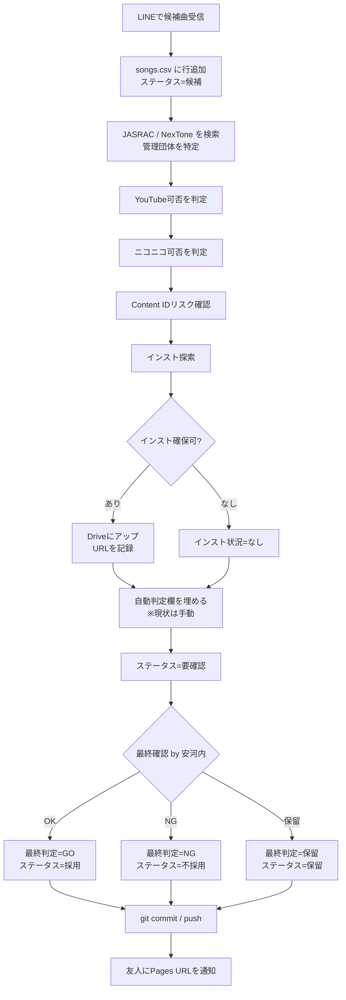

# 作業手順書（SOP）

候補曲を受け取ってから友人に判定結果を返すまでの標準作業手順。

---

## 1. 目的

友人（ご本人）から「次に歌いたい候補曲」を LINE で受け取り、**著作権をクリアし、インスト音源を確保し、GO / NG の判定を返す**こと。これが安河内の主担当業務。

歌・MIX・サムネ等の制作は友人が担当するため、**事務担当（安河内）が候補曲調査を巻き取ることで、友人が制作に集中できる**状態を作る。

---

## 2. 登場人物・ツール

| 役割 | 担当 |
|---|---|
| 制作（歌・MIX・サムネ） | 友人 |
| 候補曲提案 | 友人 |
| 著作権調査・インスト確保・判定記録 | 安河内 |
| 最終GO/NG判断 | 安河内（友人が異論あれば後で調整） |

| ツール | 用途 |
|---|---|
| LINE | 友人 → 安河内 への候補曲受け渡し |
| `songs.csv` | 全曲の状態管理（候補も投稿済みも一元） |
| Google Drive `hi-to0_inst/` | インスト音源の保管・友人への受け渡し |
| GitHub | リポジトリ管理・進捗共有 |
| GitHub Pages | 友人向け状況確認画面（`https://makotize-dev.github.io/youtube-support/`） |
| JASRAC J-WID | https://www2.jasrac.or.jp/eJwid/ |
| NexTone 作品検索 | https://search.nex-tone.co.jp/ |

---

## 3. 全体フロー



---

## 4. ステップ詳細

各ステップで**何をするか**と、**`songs.csv` のどの列を更新するか**を示す。

### Step 1: LINE で候補曲を受信

- 友人から「次これ歌いたい：A, B, C」のように候補曲が届く
- 一度に複数届くことが多い前提
- **やること：** メモして次へ

### Step 2: `songs.csv` に行を追加

各候補曲につき1行追加する。

| 列 | 値 |
|---|---|
| `No` | 既存最大値 + 1 |
| `曲名` | LINE記載のとおり |
| `アーティスト` | LINE記載のとおり |
| `候補日` | 受信した日（YYYY-MM-DD） |
| `ステータス` | `候補` |
| `データ確認状況` | `未確認` |
| `インスト状況` | `未調査` |
| その他列 | 空欄 |

### Step 3: 管理団体を調べる

JASRAC / NexTone のどちらか（または両方）が管理しているかを確認する。

#### 調べ方

1. **JASRAC J-WID** （https://www2.jasrac.or.jp/eJwid/）で曲名で検索
2. **NexTone 作品検索** （https://search.nex-tone.co.jp/）で曲名で検索
3. 両方ヒット → 両方が管理（共同管理楽曲）
4. どちらかだけヒット → そちらが管理
5. 両方ヒットしない → 個別契約 or 海外管理団体の可能性。要追加調査

#### 注意点

- 同名異曲が多い。**作曲者・アーティスト名で必ず突合**する
- ボカロ曲・歌い手オリジナル曲は登録されていないことがある
- カバー曲・編曲版は元曲とIDが違う場合がある

#### CSV更新

| 列 | 値 |
|---|---|
| `管理団体` | `JASRAC` / `NexTone` / `両方` / `なし` / `不明` |

詳細な判断基準は [copyright-guide.md](./copyright-guide.md) 参照。

### Step 4: YouTube 投稿可否を判定

YouTube は JASRAC / NexTone と包括契約を結んでいる。

| 管理団体 | YouTube可否 |
|---|---|
| JASRAC | `可`（包括契約あり） |
| NexTone | `可`（包括契約あり） |
| 両方 | `可` |
| なし（自主管理など） | `条件付き`（個別確認必要） |
| 不明 | `不明` |

#### CSV更新

| 列 | 値 |
|---|---|
| `YouTube可否` | 上の表 |

### Step 5: ニコニコ動画 投稿可否を判定

ニコニコは JASRAC とは包括契約。NexTone は要注意。

| 管理団体 | ニコニコ可否 |
|---|---|
| JASRAC のみ | `可` |
| NexTone のみ | `条件付き`（NexTone のニコニコ向け契約状況による・要確認） |
| 両方 | `可`（JASRAC側でカバーされる） |
| なし | `条件付き` |
| 不明 | `不明` |

#### CSV更新

| 列 | 値 |
|---|---|
| `ニコニコ可否` | 上の表 |

### Step 6: Content ID リスク確認

YouTube に投稿後、原盤権者が Content ID で広告収益を取る可能性がある。**収益化を狙う場合に重要。**

#### 判定の目安

| 状況 | リスク |
|---|---|
| 公式が配布するカラオケ音源（メーカー公式） | **低** |
| 配信者・ボカロP本人が公開している配布インスト | **低** |
| MIDI起こし・耳コピのインスト | **中**（編曲扱いで保護される場合あり） |
| 公式音源を加工したインスト（ボーカル除去など） | **高**（原盤一致で確実に検出される） |
| 不明（出所不明配布） | **不明** |

#### CSV更新

| 列 | 値 |
|---|---|
| `Content_IDリスク` | `低` / `中` / `高` / `不明` |

### Step 7: インストを探す

優先順位：

1. **公式カラオケ音源**（メーカー販売・カラオケDAM/JOYSOUND等）
2. **アーティスト本人配布**のインスト（YouTube・公式サイト）
3. **歌ってみた利用OKと明記**された配布インスト（ボカロPの DL リンクなど）
4. **MIDI起こし・耳コピ**のインスト（最終手段、Content ID リスク要評価）

各候補の **配布元URL・利用規約URL** を控える。

#### CSV更新

| 列 | 値 |
|---|---|
| `インスト状況` | `あり` / `なし` / `自作必要` |
| `インスト規約URL` | 配布元の規約ページURL |

### Step 8: インストを Google Drive にアップ（インストありの場合のみ）

1. `hi-to0_inst/` フォルダ内に **曲名のサブフォルダ**を作成（例：`hi-to0_inst/プロポーズ/`）
2. インストファイル（wav/mp3）をアップロード
3. 配布元規約のスクリーンショットも一緒に保管しておく（後日トラブル時のため）
4. 曲フォルダの **共有リンク** を取得（`hi-to0_inst/` 自体が友人と共有済みなので、設定は不要）

#### CSV更新

| 列 | 値 |
|---|---|
| `インスト_DriveURL` | 曲フォルダの Drive URL |

### Step 9: 自動判定欄を埋める

> **【現状は手動】** 将来的に Step 3〜7 を自動化する想定。それまでは Step 3〜8 の結果を踏まえて、安河内が手動で「この曲はGOにできるか」の暫定判定を入れる。

#### 判定の目安

| 状況 | 自動判定 |
|---|---|
| 管理団体クリア・インスト確保済・Content ID リスク低 | `GO` |
| 管理団体不明 / インスト未確保 / リスク高 | `NG` |
| 一部不明・追加調査が要る | `保留` |

#### CSV更新

| 列 | 値 |
|---|---|
| `自動判定` | `GO` / `NG` / `保留` |
| `自動判定日` | 記入日（YYYY-MM-DD） |
| `ステータス` | `要確認` |

### Step 10: 最終判定

自動判定の結果を見て、**安河内が最終的に GO/NG/保留 を決める**。判断材料が足りなければ再度 Step 3〜8 に戻る。

#### CSV更新

| 列 | 値 |
|---|---|
| `最終判定` | `GO` / `NG` / `保留` |
| `最終判定日` | 記入日（YYYY-MM-DD） |
| `データ確認状況` | `確認済` |
| `ステータス` | `採用`（GO）/ `不採用`（NG）/ `保留`（保留） |

### Step 11: コミット & push

```bash
cd /c/dev/youtube-support
git add docs/songs.csv
git commit -m "候補曲〇〇〇〇の判定追加"
git push
```

push 後、**1〜2分で GitHub Pages の画面が自動更新**される。

### Step 12: 友人に通知

LINE で画面URLを送る：

```
判定できたよ。確認して：
https://makotize-dev.github.io/youtube-support/
```

採用になった曲は、Drive のインストフォルダのリンクも併せて伝える。

---

## 5. トラブルシューティング

### 管理団体が見つからない

- 作詞者・作曲者で再検索
- アーティスト本人サイト・公式SNSで「楽曲提供範囲」をチェック
- それでも不明なら `管理団体=不明` のまま `自動判定=保留` で先送り

### インストが見つからない

- 配信プラットフォーム（Spotify / Apple Music）に公式インストがある場合あり
- 友人にMIDI起こしを依頼する選択肢もあるが、Content ID リスク中以上は避けたい
- なければ `インスト状況=なし` で `自動判定=NG`

### Content ID リスクの判断に迷う

- 「配布元」が公式アーティスト/レーベル本人かどうかを確認
- 第三者がアップしたインストは原則「中以上」と見ておくのが安全
- 判断つかなければ `不明` で `自動判定=保留`

### 投稿後に Content ID が当たった

- 異議申し立ては可能だが、収益化を狙うなら **そもそも当たらないインストを使う**方が早い
- 該当曲を `備考` に記録し、同じアーティスト/レーベルの曲は今後リスク高として扱う

---

## 6. 関連ドキュメント

- [copyright-guide.md](./copyright-guide.md) — 著作権確認の参考リンクと考え方
- [songs.csv](./songs.csv) — 全曲の状態管理（このSOPで更新する対象）
- [../candidates/_template.md](../candidates/_template.md) — 詳細な調査メモが必要な曲用のテンプレート
- [../README.md](../README.md) — リポジトリ全体の入り口

---

## 7. 自動化の将来構想（参考）

将来的に Step 3〜7 を以下のように自動化したい：

1. `songs.csv` に新しい候補行が追加される
2. CI（GitHub Actions 等）が JASRAC/NexTone API を叩き、`管理団体` `YouTube可否` `ニコニコ可否` を埋める
3. インスト探索は LLM + Web検索で候補URLを収集 → 安河内が選別
4. `自動判定` を計算ルールで埋める
5. 安河内は **最終判定だけ** に集中

これにより安河内の作業時間を 1曲あたり大幅短縮できる想定。
